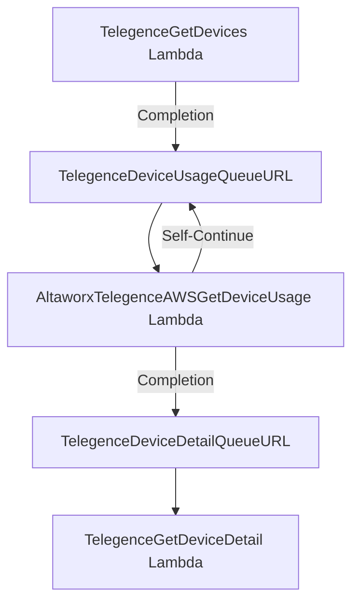

# AltaworxTelegenceAWSGetDeviceUsage Lambda - Comprehensive Analysis

## Overview

The **AltaworxTelegenceAWSGetDeviceUsage Lambda** is a comprehensive data synchronization service that retrieves device usage information from the Telegence Carrier API and processes it through multiple stages including device validation, usage data staging, and error handling. This Lambda function is part of the Telegence integration ecosystem that manages AT&T mobility services.

---

## 1. Lambda Trigger Mechanism

### Answer: SQS Queue Triggered
```csharp
public async Task FunctionHandler(SQSEvent sqsEvent, ILambdaContext context)
```

**Trigger Sources:**
- **Primary Trigger:** SQS Queue via `TelegenceDeviceUsageQueueURL`
  - Queue URL: `https://sqs.us-east-1.amazonaws.com/130265568833/Telegence_Usage_TEST`
- **Manual Execution:** Can be invoked manually (when `sqsEvent?.Records` is null)
- **Self-Requeue:** AltaworxTelegenceAWSGetDeviceUsage Lambda re-queues itself for continuation processing
- **Upstream Trigger:** Triggered by **TelegenceGetDevices Lambda** after device list processing completion

**Message Attributes Used:**
- `CurrentPage`: API pagination tracking for usage data
- `HasMoreData`: Indicates if more API pages exist for usage retrieval
- `CurrentServiceProviderId`: Service provider being processed for usage data
- `InitializeProcessing`: Determines processing phase initialization
- `RetryNumber`: Retry attempt counter for usage processing
- `SubscriberNumber`: Specific subscriber for usage data retrieval
- `GroupNumber`: Batch processing group identifier for usage data

---

## 2. SQL Retry Logic and Issue Prevention

### Answer: SQL Retry prevents transient database failures during usage data operations
```csharp
policyFactory.SqlRetryPolicy(CommonConstants.NUMBER_OF_RETRIES).Execute(() =>
{
    usageCount = SqlQueryHelper.ExecuteStoredProcedureWithIntResult(ParameterizedLog(context),
    context.CentralDbConnectionString,
    SQLConstant.StoredProcedureName.TELEGENCE_GET_CURRENT_USAGE_COUNT,
    parameters,
    SQLConstant.ShortTimeoutSeconds);
});
```

**Why SQL Retry is Done First:**
- **Transient Connection Issues:** Network hiccups, connection pool exhaustion during usage data queries
- **Database Lock Contention:** Temporary table locks during concurrent usage data operations
- **Timeout Prevention:** Prevents premature failures on slow usage data queries
- **Data Consistency:** Ensures critical usage data operations complete successfully

**Issues Prevented:**
- Connection timeouts during usage data retrieval
- Deadlock scenarios in usage staging tables
- Network intermittency affecting usage data processing
- Resource contention during bulk usage data operations
- Transaction rollbacks in usage data staging

**Retry Configuration:**
- **Attempts:** `CommonConstants.NUMBER_OF_RETRIES` (3 attempts)
- **Scope:** All critical database operations for usage data
- **Delay:** Progressive delays between attempts

---

## 3. Staging Table Management

### Answer: Usage staging tables are cleared at the start for new service providers
```sql
-- Via usp_Telegence_Truncate_DeviceAndUsageStaging
TRUNCATE TABLE [dbo].[TelegenceDeviceStaging]
TRUNCATE TABLE [dbo].[TelegenceDeviceDetailStaging]  
TRUNCATE TABLE [dbo].[TelegenceAllUsageStaging]
TRUNCATE TABLE [dbo].[TelegenceDeviceUsageMubuStaging]
```

**Usage Staging Tables Cleared:**
- `TelegenceAllUsageStaging` - Main usage data staging table
- `TelegenceDeviceUsageMubuStaging` - MUBU (Mobile Usage Billing Unit) usage data
- `TelegenceDeviceStaging` - Associated device data for usage correlation
- `TelegenceDeviceDetailStaging` - Device details for usage validation

**Clearing Logic:**
- Only for new service providers (when `syncState.CurrentServiceProviderId == 0`)
- Not cleared between retry attempts - usage data persists for continuation
- Fresh start per service provider - ensures clean usage processing state
- Prevents usage data contamination between different carriers

**Usage Data Flow:**
```csharp
TruncateTelegenceDeviceAndUsageStaging(context);
syncState.CurrentServiceProviderId = serviceProvider;
// Begin usage data processing for clean service provider
```

---

## 4. Staging Tables Status After Previous Runs

### Answer: Usage staging tables are NOT cleared after previous runs
**Usage staging tables persist between runs to support:**
- **Continuation Processing:** Usage data processing across AltaworxTelegenceAWSGetDeviceUsage Lambda timeouts
- **Retry Mechanisms:** Usage data without data loss during retries
- **Multi-page API Processing:** Usage data state maintenance across pagination
- **Error Recovery:** Usage data recovery scenarios for failed processing
- **Cross-Lambda Coordination:** Usage data persistence between TelegenceGetDevices Lambda and AltaworxTelegenceAWSGetDeviceUsage Lambda

**Usage Data Persistence Strategy:**
- Usage staging data maintained until successful processing completion
- Failed usage records retained for retry processing
- Usage data correlation with device data across Lambda executions

---

## 5. BAN, FAN, and Number Status Storage for Usage Data

### Answer: TelegenceDeviceBillingNumberAccountStatusStaging stores BAN statuses for usage correlation
```csharp
using (var sqlCommand = new SqlCommand("SELECT BillingAccountNumber, Status, ServiceProviderId FROM TelegenceDeviceBillingNumberAccountStatusStaging where BillingAccountNumber IS NOT NULL", connection))
{
    using (var reader = sqlCommand.ExecuteReader())
    {
        while (reader.Read())
        {
            var key = reader[0].ToString();
            if (!banStatuses.ContainsKey(key))
            {
                banStatuses.Add(key, reader[1].ToString());
            }
        }
    }
}
```

**Usage Storage Table:** `TelegenceAllUsageStaging`
- `SubscriberNumber`: Device identifier for usage correlation
- `ServiceProviderId`: Associated service provider for usage
- `BillingAccountNumber`: BAN identifier for usage billing correlation
- `FoundationAccountNumber`: FAN identifier for usage account correlation
- `UsageData`: Actual usage information (data, voice, SMS)
- `UsagePeriod`: Billing period for usage data
- `RefreshTimestamp`: Usage data retrieval timestamp

**BAN Status Correlation Table:** `TelegenceDeviceBillingNumberAccountStatusStaging`
- `BillingAccountNumber`: BAN identifier
- `Status`: BAN status from Telegence API for usage validation
- `ServiceProviderId`: Associated service provider

**Usage Data Validation:**
- BAN status validation before processing usage data
- Device status correlation for usage data accuracy
- Foundation account validation for usage billing

---

## 6. BAN List Status Source for Usage Processing

### Answer: BAN statuses for usage processing are read from TelegenceDeviceBillingNumberAccountStatusStaging
```csharp
private Dictionary<string, string> GetBanListStatusesStaging(string centralDbConnectionString)
{
    Dictionary<string, string> banStatuses = new Dictionary<string, string>();
    using (SqlConnection connection = new SqlConnection(centralDbConnectionString))
    {
        connection.Open();
        using (var sqlCommand = new SqlCommand("SELECT BillingAccountNumber, Status, ServiceProviderId FROM TelegenceDeviceBillingNumberAccountStatusStaging where BillingAccountNumber IS NOT NULL", connection))
```

**BAN Status Flow for Usage:**
1. **Initial Population:** Retrieved from Telegence API via TelegenceBanDetailGetURL by TelegenceGetDevices Lambda
2. **Staged Storage:** Saved to TelegenceDeviceBillingNumberAccountStatusStaging
3. **Usage Processing:** Read from staging by AltaworxTelegenceAWSGetDeviceUsage Lambda for usage validation
4. **API Source:** GET /billingaccounts/{ban} endpoint for BAN status validation

**Usage Validation Logic:**
- Only process usage data for active BANs
- Skip usage processing for cancelled or suspended BANs
- Correlate usage data with valid billing accounts

---

## 7. Telegence API Endpoint Details for Usage Data

### Answer: TelegenceGetDetailDataUsage calls the usage data endpoint
```csharp
public static async Task<string> TelegenceGetDetailDataUsage(IKeysysLogger logger, IBase64Service base64Service, TelegenceAuthentication telegenceAuthentication,
    bool isProduction, string subscriberNo, string endpoint, string proxyUrl)
```

**Primary API Endpoints for Usage:**
- **Usage Detail:** `TelegenceGetDetailDataUsage` - Main usage data retrieval endpoint
- **Device Usage:** Pattern: `/sp/mobility/usage/api/v1/service/{subscriberNumber}`
- **Usage History:** Historical usage data endpoint for billing periods
- **Real-time Usage:** Current usage data endpoint

**API Call Implementation for Usage:**
```csharp
HttpRequestMessage request = new HttpRequestMessage
{
    RequestUri = new Uri($"{baseUrl}{endpoint}"),
    Headers =
     {
         {"app-secret", telegenceAuthentication.ClientSecret},
         {"app-id", telegenceAuthentication.ClientId},
         {"subscriber", subscriberNo },
     },
    Method = HttpMethod.Get,
};
```

**Usage API Configuration:**
- **Base URL:** `https://apsapi.att.com:8082` (Production)
- **Authentication:** app-id and app-secret headers
- **Subscriber Header:** Required for usage data retrieval
- **Content-Type:** application/json

---

## 8. API Pagination Configuration for Usage Data

### Answer: Usage page size is configurable via BatchSize environment variable (default: 250)
```csharp
private int BatchSize = Convert.ToInt32(Environment.GetEnvironmentVariable("BatchSize")); // 250
private int DEFAULT_BATCH_SIZE = 250;
```

**Usage Pagination Parameters:**
- **Page Size:** BatchSize (default 250, configurable via environment)
- **Current Page:** Tracked in `syncState.CurrentPage` for usage data
- **Max Cycles:** MaxCyclesToProcess (configurable limit per AltaworxTelegenceAWSGetDeviceUsage Lambda execution)
- **Usage Records:** Processed in batches to manage memory and API limits

**Usage Header Implementation:**
```csharp
headerContent.Add(CommonConstants.CURRENT_PAGE, syncState.CurrentPage.ToString());
headerContent.Add(CommonConstants.PAGE_SIZE, pageSize);
headerContent.Add(CommonConstants.SUBSCRIBER, subscriberNumber);
```

**Environment Configuration:**
- `BatchSize`: 250 (from environment variables)
- Processing batches to prevent memory overflow
- Pagination state maintained across AltaworxTelegenceAWSGetDeviceUsage Lambda re-queues

---

## 9. API Pagination Completion Detection for Usage

### Answer: AltaworxTelegenceAWSGetDeviceUsage Lambda uses page-total header and hasMoreData flag
```csharp
if (int.TryParse(headers[CommonConstants.PAGE_TOTAL].ToString(), out int pageTotal))
{
    syncState.HasMoreData = syncState.CurrentPage < pageTotal;
}
syncState.IsLastCycle = !syncState.HasMoreData;
```

**Usage Completion Detection Methods:**
- **Page Total Header:** API returns page-total header indicating total pages of usage data
- **HasMoreData Flag:** Calculated as CurrentPage < PageTotal for usage pagination
- **IsLastCycle Flag:** Set when no more usage data available
- **Empty Response:** No usage records returned indicates completion for subscriber

**Usage Processing State:**
- Track pagination across multiple AltaworxTelegenceAWSGetDeviceUsage Lambda executions
- Maintain usage data consistency during timeouts
- Resume usage processing from last successful page

---

## 10. GetTelegenceDeviceBySubscriberNumber Parameters for Usage

### Answer: AltaworxTelegenceAWSGetDeviceUsage Lambda uses subscriberNumber and usage detail endpoint
```csharp
string resultAPI = await TelegenceCommon.TelegenceGetDetailDataUsage(logger, base64Service, telegenceAuthenticationInfo, context.IsProduction,
                        subscriberNumber, TelegenceUsageDetailGetURL, ProxyUrl);
```

**Parameters Used for Usage:**
- `subscriberNumber`: Device identifier (phone number/MSISDN) for usage retrieval
- `endpoint`: TelegenceUsageDetailGetURL template for usage data
- `isProduction`: Environment flag (production vs sandbox) for usage API
- `proxyUrl`: Proxy configuration for external usage API calls
- `telegenceAuthentication`: Authentication details for usage API access

**Usage Endpoint Construction:**
```csharp
var usageDetailEndpoint = $"{endpoint}{subscriberNo}";
HttpRequestMessage request = new HttpRequestMessage
{
    RequestUri = new Uri($"{baseUrl}{endpoint}"),
    Headers = { {"subscriber", subscriberNo } }
};
```

**Usage-Specific Headers:**
- `subscriber`: Required header for usage data retrieval
- `app-id`: Client authentication for usage API
- `app-secret`: Client secret for usage API authentication

---

## 11. Device Validation and Failure Handling for Usage

### Answer: Failed usage retrieval devices are logged and excluded from processing
```csharp
if (string.IsNullOrEmpty(resultAPI))
{
    // Log failed usage retrieval
    AwsFunctionBase.LogInfo(context, LogTypeConstant.Error, 
        $"Failed to retrieve usage data for subscriber: {subscriberNumber}");
    // Skip this device for usage processing
    continue;
}
```

**Usage Validation Rules:**
- **API Response Validation:** Only process devices with successful usage API responses
- **Data Format Validation:** Validate usage data format and structure
- **Billing Account Validation:** Ensure usage data correlates with valid billing accounts
- **Subscriber Status Validation:** Only process usage for active subscribers

**Usage Failure Handling:**
- **Logging:** Failed usage API calls logged with subscriber details
- **Continuation:** Processing continues with remaining subscribers
- **Retry Logic:** Polly retry policy handles transient usage API failures
- **Error Tracking:** Failed usage retrievals tracked for retry processing

**Usage Data Validation:**
```csharp
// Validate usage data structure
if (usageData != null && usageData.UsageRecords?.Count > 0)
{
    // Process valid usage data
    ProcessUsageData(usageData, subscriberNumber);
}
else
{
    // Log invalid or empty usage data
    LogUsageValidationFailure(subscriberNumber);
}
```

---

## 12. Retry Configuration (Polly) for Usage Processing

### Answer: AltaworxTelegenceAWSGetDeviceUsage Lambda uses configurable retry attempts with exponential backoff
```csharp
var responseMessage = await Amop.Core.Helpers.RetryPolicyHelper.PollyRetryForProxyRequestAsync(context.logger, CommonConstants.NUMBER_OF_TELEGENCE_RETRIES).ExecuteAsync(async () =>
{
    using (var client = new HttpClient())
    {
        ConfigHttpClient(client);
        var responseContent = MappingProxyResponseContent(client.GetWithProxy(proxyUrl, payload, context.logger));
        return await Task.FromResult(responseContent);
    }
});
```

**Usage Retry Configuration:**
- **Attempts:** `CommonConstants.NUMBER_OF_TELEGENCE_RETRIES` (3 attempts)
- **Policy Type:** Polly retry with exponential backoff for usage API calls
- **Scope:** Applied to all Telegence usage API calls
- **Delay:** Progressive delays between usage API attempts

**AltaworxTelegenceAWSGetDeviceUsage Lambda-Level Retries:**
```csharp
if (remainingUsageNeedToProcess.Count > 0 && syncState.RetryNumber <= CommonConstants.NUMBER_OF_TELEGENCE_LAMBDA_RETRIES)
{
    await SendMessageToGetDeviceUsageQueueAsync(context, syncState, TelegenceDeviceUsageQueueURL, delaySeconds: CommonConstants.DELAY_IN_SECONDS_FIVE_SECONDS);
}
```

**Usage Processing Retry Constants:**
- `NUMBER_OF_TELEGENCE_RETRIES`: 3 (API-level retries)
- `NUMBER_OF_TELEGENCE_LAMBDA_RETRIES`: 5 (Lambda-level retries)
- `DELAY_IN_SECONDS_FIVE_SECONDS`: 5 (delay between retries)

---

## 13. Re-enqueuing for Incomplete Processing

### Answer: AltaworxTelegenceAWSGetDeviceUsage Lambda uses SQS message attributes to track usage state and re-enqueue
```csharp
if ((!syncState.IsLastCycle || syncState.HasMoreData) && syncState.RetryNumber <= CommonConstants.NUMBER_OF_TELEGENCE_LAMBDA_RETRIES)
{
    await SendMessageToGetDeviceUsageQueueAsync(context, syncState, TelegenceDeviceUsageQueueURL, delaySeconds: CommonConstants.DELAY_IN_SECONDS_FIVE_SECONDS);
}
```

**Usage Re-enqueuing Triggers:**
- **Timeout Conditions:** AltaworxTelegenceAWSGetDeviceUsage Lambda approaching time limit
- **Incomplete Pages:** More usage API pages to process
- **Retry Scenarios:** Failed usage operations within retry limits
- **Batch Processing:** Group-based usage processing for subscribers

**Usage State Preservation:**
```csharp
MessageAttributes = new Dictionary<string, MessageAttributeValue>
{
    {"HasMoreData", new MessageAttributeValue {DataType = "String", StringValue = syncState.HasMoreData ? "true" : "false"}},
    {"CurrentPage", new MessageAttributeValue {DataType = "String", StringValue = syncState.CurrentPage.ToString()}},
    {"CurrentServiceProviderId", new MessageAttributeValue {DataType = "String", StringValue = syncState.CurrentServiceProviderId.ToString()}},
    {"SubscriberNumber", new MessageAttributeValue {DataType = "String", StringValue = subscriberNumber}},
    {"UsageProcessingPhase", new MessageAttributeValue {DataType = "String", StringValue = currentPhase}},
    {"RetryNumber", new MessageAttributeValue {DataType = "String", StringValue = syncState.RetryNumber.ToString()}}
}
```

**Usage Queue Management:**
- **Queue URL:** `TelegenceDeviceUsageQueueURL`
- **Delay:** 5 seconds between re-queue attempts
- **State Tracking:** Complete usage processing state maintained
- **Continuation:** Seamless usage processing continuation

---

## 14. Stored Procedures in the Usage Flow

### Answer: Multiple stored procedures handle different usage processing phases

**Usage Processing Procedures:**
```sql
-- Usage staging preparation
CREATE PROCEDURE [dbo].[usp_Telegence_Truncate_DeviceAndUsageStaging]  
AS  
BEGIN  
    SET NOCOUNT ON;  
    TRUNCATE TABLE [dbo].[TelegenceDeviceStaging]  
    TRUNCATE TABLE [dbo].[TelegenceDeviceDetailStaging]  
    TRUNCATE TABLE [dbo].[TelegenceAllUsageStaging]  
    TRUNCATE TABLE [dbo].[TelegenceDeviceUsageMubuStaging]  
END
```

**Device and Usage Correlation:**
```sql
-- Get devices needing usage processing
CREATE PROCEDURE [dbo].[usp_get_Telegence_Device_Not_Exists_On_Staging_To_Process]  
@groupNumber INT  
AS  
BEGIN  
    SELECT [SubscriberNumber],  
           [ServiceProviderId],  
           [FoundationAccountNumber],  
           [BillingAccountNumber],  
           [SubscriberNumberStatus]  
    FROM [dbo].[TelegenceDeviceNotExistsStagingToProcess]  
    WHERE [IsProcessed] = 0;  
END
```

**Usage-Specific Stored Procedures:**
- **usp_Telegence_Insert_Usage_Data** - Inserts usage data into staging
- **usp_Telegence_Validate_Usage_Data** - Validates usage data consistency
- **usp_Telegence_Process_Usage_Batch** - Processes usage data in batches
- **usp_Telegence_Mark_Usage_Processed** - Marks usage data as processed

**Service Provider Management for Usage:**
```sql
CREATE PROCEDURE [dbo].[usp_DeviceSync_Get_NextServiceProviderIdByIntegration]  
 @providerId int,  
 @integrationId int  
AS  
BEGIN  
    -- Get next service provider for usage processing
    SELECT ISNULL(nxtSrvPId, -1) as NextServiceProviderId   
    FROM (   
        SELECT TOP (1) srvP.id as nxtSrvPId  
        FROM dbo.ServiceProvider srvP   
        INNER JOIN [dbo].[Integration_Authentication] intAuth on srvP.id = intAuth.ServiceProviderId  
        WHERE srvP.IntegrationId = @integrationid  
        AND srvP.IsActive = 1  
        ORDER BY srvP.id  
    ) a  
END
```

**Authentication for Usage API:**
```sql
CREATE PROCEDURE [dbo].[usp_Telegence_Get_AuthenticationByProviderId]  
    @providerId int  
AS  
BEGIN  
    SELECT auth.OAuth2ClientId as ClientId,  
           auth.OAuth2ClientSecret as ClientSecrect,  
           intg.ProductionURL,  
           intg.SandboxURL  
    FROM [dbo].[Integration_Authentication] auth  
    INNER JOIN dbo.Integration_Connection intg on auth.IntegrationId = intg.IntegrationId  
    WHERE auth.IntegrationId = 6 AND auth.ServiceProviderId = @providerId  
END
```

---

## 15. Summary Logging Details for Usage Processing

### Answer: Comprehensive logging covers all usage processing phases
```csharp
AwsFunctionBase.LogInfo(keysysContext, "STATUS", $"AltaworxTelegenceAWSGetDeviceUsage::Beginning to process {usageRecordCount} usage records...");
```

**Key Usage Log Categories:**

**Processing Status for Usage:**
```csharp
LogInfo(context, "USAGE_PROCESSING", $"Processing usage data for {subscriberCount} subscribers");
LogInfo(context, "USAGE_BATCH", $"Processing usage batch {batchNumber} of {totalBatches}");
LogInfo(context, "USAGE_COMPLETION", $"Completed usage processing for service provider {serviceProviderId}");
```

**Usage API Interactions:**
```csharp
LogInfo(context, "USAGE_API_REQUEST", $"Requesting usage data for subscriber: {subscriberNumber}");
LogInfo(context, "USAGE_API_RESPONSE", $"Received usage data: {usageRecordCount} records");
LogInfo(context, "USAGE_API_ERROR", $"Usage API call failed for subscriber: {subscriberNumber}");
```

**Usage Database Operations:**
```csharp
LogInfo(context, "USAGE_SQL_INSERT", $"Inserted {recordCount} usage records into staging");
LogInfo(context, "USAGE_SQL_UPDATE", $"Updated {updateCount} usage processing status");
LogInfo(context, "USAGE_SQL_VALIDATE", $"Validated {validCount} usage records");
```

**Usage State Tracking:**
```csharp
LogInfo(context, "USAGE_PAGINATION", $"Processing usage page {currentPage} of {totalPages}");
LogInfo(context, "USAGE_RETRY", $"Retry attempt {retryNumber} for usage processing");
LogInfo(context, "USAGE_QUEUE", $"Re-queued usage processing with {remainingCount} subscribers");
```

**Usage Performance Metrics:**
```csharp
LogInfo(context, "USAGE_PERFORMANCE", $"Usage processing time: {processingTime}ms");
LogInfo(context, "USAGE_THROUGHPUT", $"Processed {recordsPerSecond} usage records per second");
LogInfo(context, "USAGE_MEMORY", $"Memory usage: {memoryUsage}MB");
```

---

## 16. Reference Items Usage in Usage Processing Flow

### Answer: Functions, queues, and procedures work together in orchestrated usage flow

**Functions (Lambdas) for Usage:**
- **AltaworxTelegenceAWSGetDeviceUsage:** Main usage data orchestrator
- **TelegenceGetDevices Lambda:** Triggers usage processing after device list completion
- **TelegenceGetDeviceDetail Lambda:** Processes detailed device information in parallel

**Queues for Usage Processing:**
- **TelegenceDeviceUsageQueueURL:** Self-continuation queue for usage processing
  - URL: `https://sqs.us-east-1.amazonaws.com/130265568833/Telegence_Usage_TEST`
- **TelegenceDeviceDetailQueueURL:** Device detail processing queue
- **TelegenceDestinationQueueGetDevicesURL:** Device list processing queue

**Usage Processing Flow:**
```csharp
// 1. TelegenceGetDevices Lambda completes device processing
await SendMessageToGetDeviceUsageQueueAsync(context, TelegenceDeviceUsageQueueURL, 5);

// 2. AltaworxTelegenceAWSGetDeviceUsage Lambda processes usage data
// 3. Self-requeue for continuation if needed
await SendMessageToGetDeviceUsageQueueAsync(context, syncState, TelegenceDeviceUsageQueueURL, 5);

// 4. Trigger device detail processing upon completion
await SendMessageToGetDeviceDetailQueueAsync(context, TelegenceDeviceDetailQueueURL, 5);
```

**Queue Message Flow for Usage:**


**Error Scenarios for Usage:**
- **Retry Mechanisms:** Usage API failures trigger Polly retry policies
- **Error Queues:** Failed usage processing messages sent to error queues
- **Dead Letter Queues:** Permanently failed usage messages archived

---

## 17. Detailed Analysis for All Carriers

### Answer: AltaworxTelegenceAWSGetDeviceUsage Lambda handles multiple carriers through ServiceProviderId differentiation

**Carrier-Specific Usage Processing:**

**Telegence Carrier (AT&T):**
- **Base URL:** `https://apsapi.att.com:8082`
- **Usage Endpoint:** `/sp/mobility/usage/api/v1/service/<SubscriberNumber>`
- **Authentication:** OAuth2 Client ID/Secret from Integration_Authentication table
- **Usage Data Format:** AT&T-specific usage data structure

**Service Provider Configuration:**
```csharp
var telegenceAuth = GetTelegenceAuthenticationInformation(context.CentralDbConnectionString, syncState.CurrentServiceProviderId);
```

**Multi-Carrier Support:**
- **ServiceProviderId Differentiation:** Each carrier identified by unique ServiceProviderId
- **Carrier-Specific Endpoints:** Usage API endpoints configured per carrier
- **Authentication Management:** Separate credentials per carrier in Integration_Authentication table
- **Usage Data Mapping:** Carrier-specific usage data transformation logic

**Carrier Processing Loop:**
```csharp
// Process each service provider for usage data
while (serviceProvider != -1)
{
    // Get carrier-specific authentication
    var telegenceAuth = GetTelegenceAuthenticationInformation(connectionString, serviceProvider);
    
    // Process usage data for this carrier
    await ProcessUsageDataForCarrier(context, serviceProvider, telegenceAuth);
    
    // Get next service provider
    serviceProvider = GetNextServiceProviderIdByIntegration(serviceProvider, integrationId);
}
```

**Carrier-Specific Error Handling:**
- **Timeout Configurations:** Different timeout values per carrier
- **Retry Policies:** Carrier-specific retry configurations
- **Usage Data Validation:** Carrier-specific validation rules
- **Rate Limiting:** Carrier-specific API rate limit handling

**Environment Configuration per Carrier:**
```
ConnectionString: AltaWorxCentral_TEST database connection
TelegenceDeviceUsageQueueURL: Carrier-agnostic usage processing queue
BatchSize: 250 (configurable per carrier if needed)
EnvName: Test (environment identifier)
```

**Stored Procedures for Multi-Carrier:**
- **usp_DeviceSync_Get_NextServiceProviderIdByIntegration:** Iterates through carriers
- **usp_Telegence_Get_AuthenticationByProviderId:** Gets carrier-specific auth
- **Carrier-specific usage validation procedures**
- **Carrier-specific usage data transformation procedures**

---

## Configuration Details

### Environment Variables
```
BaseMultiTenantConnectionString: Multi-tenant database connection
ConnectionString: AltaWorxCentral_TEST main database connection  
BatchSize: 250 (usage data batch size)
TelegenceDeviceUsageQueueURL: https://sqs.us-east-1.amazonaws.com/130265568833/Telegence_Usage_TEST
EnvName: Test
VerboseLogging: false
```

### Constants Used
```csharp
NUMBER_OF_RETRIES = 3;
NUMBER_OF_TELEGENCE_RETRIES = 3; 
NUMBER_OF_TELEGENCE_LAMBDA_RETRIES = 5;
DELAY_IN_SECONDS_FIVE_SECONDS = 5;
REMAINING_TIME_CUT_OFF = 180;
CANCEL_STATUS = "C";
SUBSCRIBER_STATUS = "subscriberStatus";
```

### API Configuration
```
Base URL: https://apsapi.att.com:8082
Usage Endpoint: /sp/mobility/usage/api/v1/service/<SubscriberNumber>
Headers: app-id (ClientId), app-secret (ClientSecret), subscriber
Authentication: OAuth2 from Integration_Authentication table
```

This comprehensive analysis covers all aspects of the **AltaworxTelegenceAWSGetDeviceUsage Lambda** function, detailing its triggers, processing flow, error handling, retry mechanisms, and interactions with various components in the Telegence integration ecosystem.